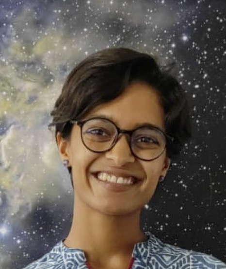
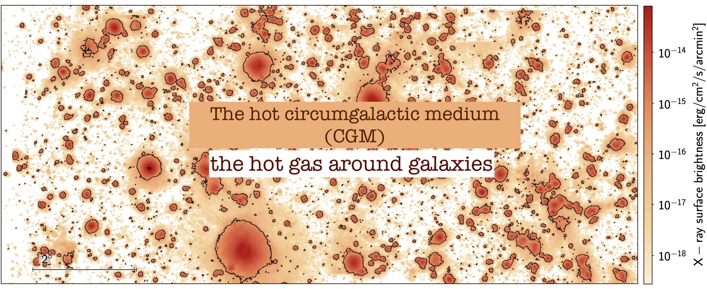
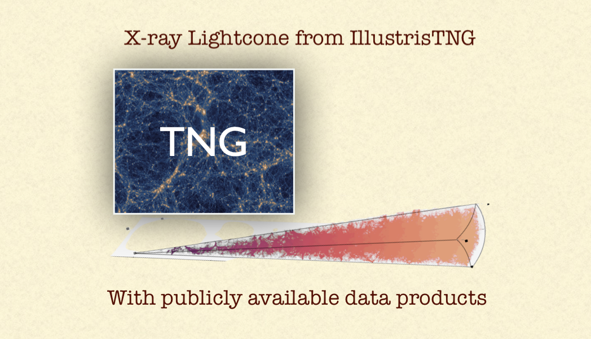
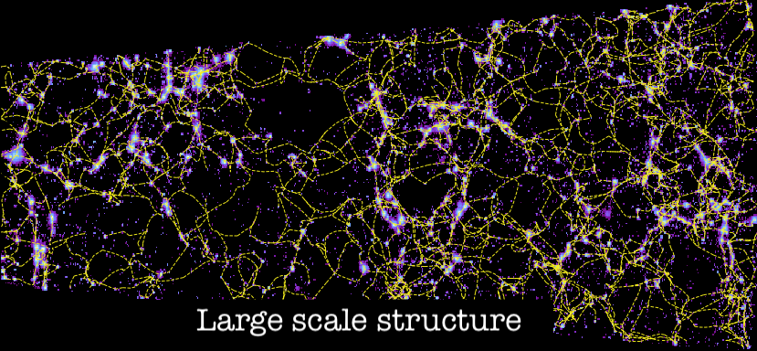
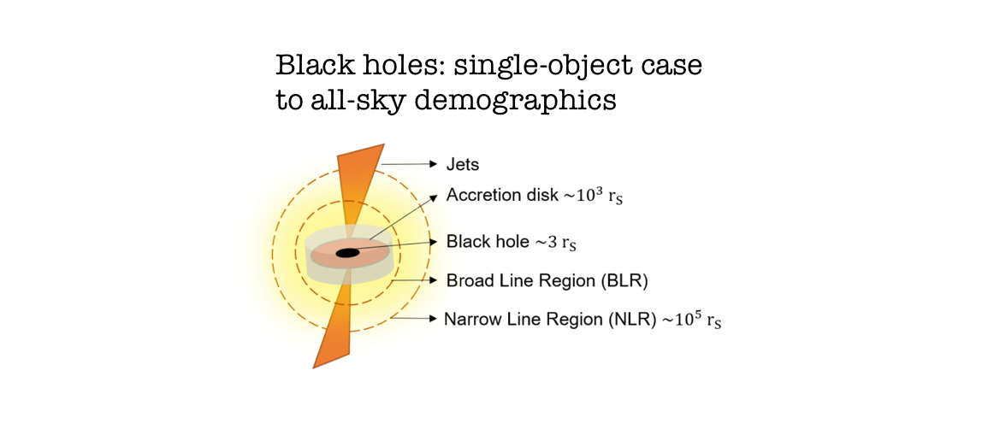
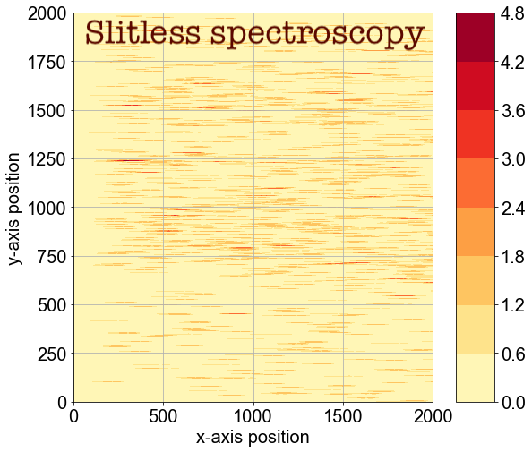
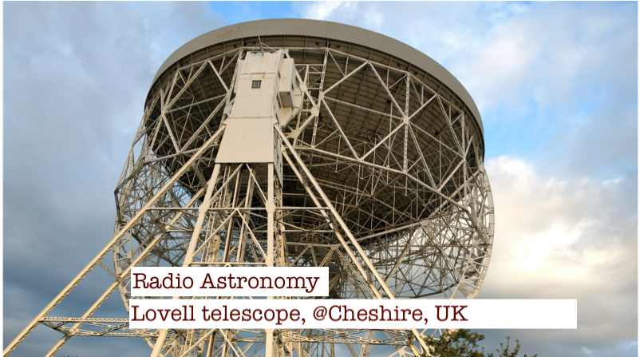
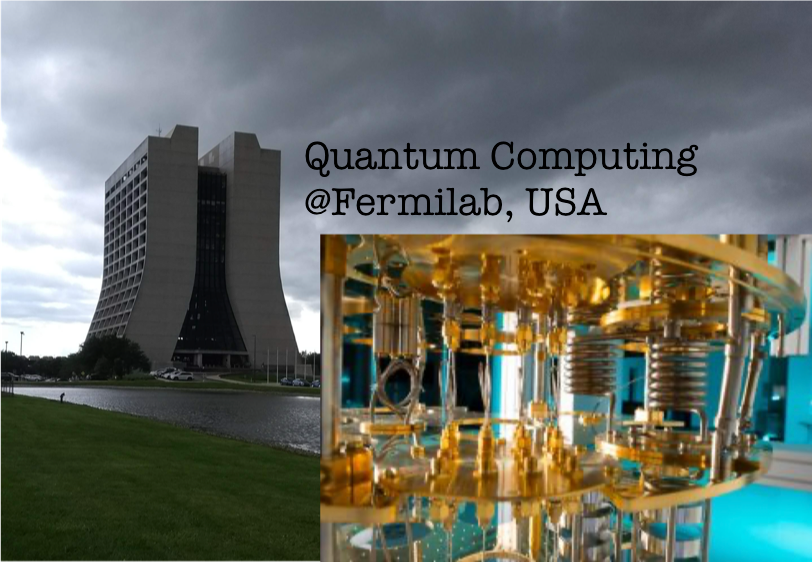

# Soumya Shreeram

<meta name="google-site-verification" content="jPji4uauk0tbUFCW2VTstG8g0GsxWhslB5MGPMOzLWk" /> 

I am an astrophysicist and research software developer, and I am currently working as a data scientist. I completed my PhD in 2025 at the Max Planck Institute for Extraterrestrial Physics, where I focused on forward modelling the hot circumgalactic medium in X-rays. Before this, I completed my Master's in Physics at EPFL in Switzerland and my Bachelor's in Physics with Astrophysics at the University of Manchester in the UK.

Quick links:

- [my doctoral thesis](https://edoc.ub.uni-muenchen.de/36138/)
- [my publications record](publications.md)

My work on various science projects over the years are summarized below.

---

# Science Projects

<!-- hot CGM -->

  

    

      
    

    

      <h3> My work on the hot CGM</h3>
      
Using my IllustrisTNG-based lightcone, I led a study on the projection effects in the X-ray emitting hot CGM around galaxies. <a href="https://arxiv.org/abs/2409.10397" target="_blank">View publication here</a>

      
See also my work on building a forward-model for X-ray data from eROSITA to retreive the hot CGM.<a href="https://arxiv.org/abs/2504.03840" target=>View publication here</a>
        

    

  

<!-- TNG lightcone -->

  

    

      
    

    

      <h3>Construction of X-ray Lightcones from Hydrosims</h3>
      
My work on building X-ray lightcones from IllustrisTNG to study the hot gas around galaxies.

      <a href="https://soumyashreeram.github.io/soumya_shreeram.github.io/lightcone/" target="_blank">
        View further info
      </a>
    

  

<!-- LSS -->

  

    

      
    

    

      <h3> The cosmic web </h3>
      
My work on cosmic web classification and it's impact on the hot CGM. <a href="https://arxiv.org/abs/2506.17222" target="_blank">View publication here</a>

      
My work on building observational filament catalogs for detecting filaments in X-rays with eROSITA. <a href="https://github.com/SoumyaShreeram/cosmic_filaments" target="_blank">View on GitHub</a>
        

    

  

<!-- black holes -->

  

    

      
    

    

      <h3> Black holes</h3>
      
I worked on modelling the spectra of black hole X-ray binary GRS 1915+105 at Oxford, UK. <a href="https://arxiv.org/abs/1912.06833" target="_blank">View publication here</a>

      
My master thesis work was on modifing the demographics of the Active Galactic Nuclei in dark matter only simulations. <a href="https://github.com/SoumyaShreeram/Locating_AGN_in_DM_halos" target="_blank">View on GitHub (thesis therein)</a>
        

    

  

<!-- Slitless spec -->

  

    

      
    

    

      <h3>Study of the Galactic Centre Region of the Milky Way Using Slitless Spectroscopy</h3>
      
This project, conducted at MPIA, Heidelberg, Germany, aimed to distinguish between early and late-type stars in the Galactic Centre Region using Slitless Spectroscopy. 
      <a href="https://github.com/SoumyaShreeram/Slitless_spectroscopy/" target="_blank">See code and project report on Github.

      </a>
    

  

 

<!-- Pulsars -->

  

    

      
    

    

      <h3>Pulsars: radio astronomy</h3>
      
This experiment investigates pulsar properties. The data for the experiment was obtained from the radio telescopes at Jodrell Bank Observatory, Cheshire. 
      <a href="https://bb511.github.io/CrabPulsar/index.html" target="_blank">
        Visit the website showing our results

      </a>
    

  

<!-- Quantum computing -->

  

    

      
    

    

      <h3>Studying Qubit Interactions with Multimode Cavities Using QuTiP</h3>
      
My work on using QuTiP, a quantum computing framework, to simulate interactions between two-qubits coupled with each other via three resonators. 
      <a href="https://github.com/SoumyaShreeram/Qubit/" target="_blank">
        View code and report here
      </a>
    

  

<!-- ML in astro -->

  

    

      
    

    

      <h3>AI/ML in astronomy</h3>
      
During my masters, I worked on classifying SDSS spectra using Neural networks. <a href="https://github.com/SoumyaShreeram/Analyzing_spectra_with_ML/" target="_blank">View on Github (final report therein)</a>

      
I also worked on applying neural networks in the field of microlensing, for classifying the source radius of microlensing light curves. <a href="https://github.com/SoumyaShreeram/Microlensing_with_NeuralNets/" target="_blank">View on GitHub (final report therein)</a>
        

    

  

---
# Contact

You can reach me at shreeramsoumya [at] gmail [dot] com. 
