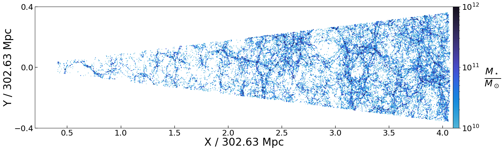
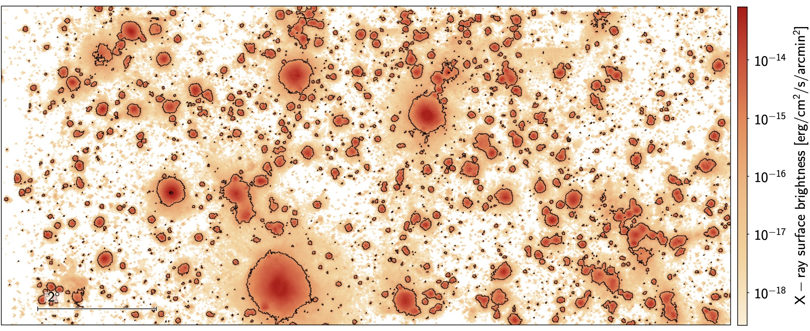

# TNG300 X-ray Lightcone, LC-TNGX

LC-TNGX is made available [here](data.md#lc-tngx). Here, we give some key details and expand on the data structure of the public TNG300-based X-ray lightcone.


We use the [IllustrisTNG cosmological hydrodynamical simulation](https://www.tng-project.org/) with the box of side length \(302.6\) Mpc (TNG300) to construct a lightcone. The lightcone is described in detail in Shreeram et al. 2025a: [Quantifying Observational Projection Effects with a Simulation-Based Hot CGM Model](https://www.aanda.org/articles/aa/abs/2025/05/aa52271-24/aa52271-24.html); particularly see Sec. 2. 


*Figure 1 from [Shreeram et al. 2025a](https://www.aanda.org/articles/aa/pdf/2025/05/aa52271-24.pdf), which is an illustration of the lightcone built using TNG300 in the x − y plane.*


## Lightcone Construction

LC-TNGX models the hot gas emission in X-rays in the redshift range \(0.03 \lesssim z \lesssim 0.3\), to mock observations in the local Universe. The code used to generate the lightcone is also publicly available: [LightGen](data.md).  


*Figure 2 from [Shreeram et al. 2025a](https://www.aanda.org/articles/aa/pdf/2025/05/aa52271-24.pdf), showing the projected rest-frame X-ray events from the TNG300 ligthcone in the 0.5−2.0 keV band.*

We box remap all snapshots into a configuration where the most extended length of one of the sides is approximately four times the original length ([Carlson & White 2010](https://iopscience.iop.org/article/10.1088/0067-0049/190/2/311); see also [this](https://mwhite.berkeley.edu/BoxRemap/) website). This technique ensures that the new elongated box has a one-to-one remapping, remains volume-preserving, and preserves local structures. For a box whose original dimensions are normalized to \((1,1,1)\), the unique solution for the transformed box sides is \((4.1231, 0.7276, 0.3333)\). The opening angles for the observer are (10.16, 4.64) degrees and the area subtended in the sky for the observer is 47.28 sq. degress. We remap the coordinates of the gas cells, dark matter particles, and the halo and subhalo catalogues.


## Directory & File Descriptions

This public lightcone is constructed using 19 snapshots within the observationally motivated redshift range \(0.03 \leq z \leq 0.3\). Therefore, the data files of LC-TNGX are named after the snapshots. E.g., `lightcone_xray_XX`, where `XX` goes from 78-96 (\(0.03 \leq z \leq 0.3\) ). Snapshot numbering matches the standard IllustrisTNG convention. Each of the `lightcone_xray_SNXX.hdf5` file contains the following subdirectories `['Gas', 'XrayEvents', 'XrayPhotons']`, which are containing the following information described below.

```python
import h5py as h5

with h5.File(f"{filapath}/lightcone_xray_096.hdf5", "r") as f:
    print(list(f.keys()))
    print(list(f["Gas/data"].keys()))
    print(list(f["XrayEvents/data"].keys()))
    print(list(f["XrayPhotons/data"].keys()))
```
outputs the following:

```python
['Gas', 'XrayEvents', 'XrayPhotons']
['Zmet', 'density', 'hsml', 'mass', 'pos', 'sfr', 'temperature', 'vel', 'x_H', 'x_e']
['density', 'eobs', 'event_positions', 'los', 'num_photons', 'redshift_ph', 'temperature', 'xsky', 'ysky']
['density', 'dx', 'energy', 'num_photons', 'temperature', 'vx', 'vy', 'vz', 'x', 'y', 'z']
```

We further describe the quantities in the directories `Gas/`, `XrayEvents/`, and `XrayPhotons/` in the following subsections.

### `Gas/`

This directory contains the properties of gas cells across the lightcone. The files within describe the thermodynamic and physical characteristics of the gas cells from TNG that contributes to the lightcone. Each snapshot corresponds to a shell of the lightcone.

<details>
  <summary>
    lightcone_xray_SNXX.hdf5/Gas/data/
  </summary>

  <p style="margin-top: 0.8rem;">
    Gas cell properties corresponding to the remapped IllustrisTNG snapshots
    used for construction of the lightcone. Units follow the original
    IllustrisTNG snapshot specification (PartType0). See:
    <a href="https://www.tng-project.org/data/docs/specifications/#parttype0" target="_blank">
      https://www.tng-project.org/data/docs/specifications/#parttype0
    </a>
  </p>

  <table class="tng-table">
    <thead>
      <tr>
        <th>Column</th>
        <th>Description</th>
      </tr>
    </thead>
    <tbody>

      <tr>
        <td><code>Zmet</code></td>
        <td>
          Gas metallicity. Defined as 
          <code>GFM_Metallicity / 0.0127</code> from the original TNG snapshot.
        </td>
      </tr>

      <tr>
        <td><code>density</code></td>
        <td>
          Gas cell density (same definition as <code>PartType0/Density</code> in TNG).
        </td>
      </tr>

      <tr>
        <td><code>hsml</code></td>
        <td>
          Gas cell smoothing length computed as
          <code>hsml = 2.0 * (3 * vol / (4.0 * π))^(1/3)</code>,
          where <code>vol</code> is the Voronoi cell volume.
        </td>
      </tr>

      <tr>
        <td><code>mass</code></td>
        <td>
          Gas cell mass (same definition as <code>PartType0/Masses</code>).
        </td>
      </tr>

      <tr>
        <td><code>pos</code></td>
        <td>
          Three-dimensional comoving position of the gas cell
          (same definition as <code>PartType0/Coordinates</code>).
        </td>
      </tr>

      <tr>
        <td><code>sfr</code></td>
        <td>
          Star formation rate of the gas cell
          (same definition as <code>PartType0/StarFormationRate</code>).
        </td>
      </tr>

      <tr>
        <td><code>temperature</code></td>
        <td>
          Gas temperature derived from internal energy and electron abundance
          (same definition as <code>PartType0/InternalEnergy</code>-based temperature).
        </td>
      </tr>

      <tr>
        <td><code>vel</code></td>
        <td>
          Three-dimensional peculiar velocity of the gas cell
          (same definition as <code>PartType0/Velocities</code>).
        </td>
      </tr>

      <tr>
        <td><code>x_H</code></td>
        <td>
          Hydrogen mass fraction of the gas cell. When not available (e.g., for the mini-snaps), set to 0.76.
        </td>
      </tr>

      <tr>
        <td><code>x_e</code></td>
        <td>
          Electron abundance of the gas cell
          (same definition as <code>PartType0/ElectronAbundance</code>).
        </td>
      </tr>

    </tbody>
  </table>

</details>

### `XrayEvents/` and `XrayPhotons/`

Files corresponding to the X-ray emission from gas in LC-TNGX. The X-ray events are generated using [pyXSIM](https://hea-www.cfa.harvard.edu/~jzuhone/pyxsim/)  in the 0.5 - 2 keV X-ray energy band, using the [Asplund et al. 2009](https://arxiv.org/pdf/0909.0948) abundance tables.

The `XrayPhotons/` directory is the merged outputs of the [`make_photons()`](https://hea-www.cfa.harvard.edu/~jzuhone/pyxsim/photon_lists/generation.html) function in pyXSIM. The `XrayEvents/` directory is the merged data products of pyXSIM function [`project_photons()`](https://hea-www.cfa.harvard.edu/~jzuhone/pyxsim/photon_lists/event_lists.html#event-lists), representing the synthetic observations enabling comparison with real observed data (e.g., [Shreeram et al. 2025b](https://www.aanda.org/articles/aa/abs/2025/11/aa54508-25/aa54508-25.html)). Please refer to the pyXsim documentation for details on the file properties.


<details>
  <summary>
    lightcone_xray_SNXX.hdf5/XrayEvents
  </summary>

  <p style="margin-top: 0.8rem;">
    X-ray photons and event file generated from pyXsim. Each row corresponds to a single detected event in the 0.5−2.0 keV band for a telescope with energy-independent collecting area 1000 cm sq. and exposure time of 1000 ks.
  </p>

  <table class="tng-table">
    <thead>
      <tr>
        <th>Column</th>
        <th>Units</th>
        <th>Description</th>
      </tr>
    </thead>
    <tbody>

      <tr>
        <td><code>xsky</code></td>
        <td>deg</td>
        <td>Right Ascension (J2000).</td>
      </tr>

      <tr>
        <td><code>ysky</code></td>
        <td>deg</td>
        <td>Declination (J2000).</td>
      </tr>

      <tr>
        <td><code>eobs</code></td>
        <td>keV</td>
        <td>Photon energy.</td>
      </tr>

      <tr>
        <td><code>los</code></td>
        <td>pkpc</td>
        <td>Line-of-sight distance to the X-ray event.</td>
      </tr>

      <tr>
        <td><code>redshift_ph</code></td>
        <td>–</td>
        <td>Redshift of the photon.</td>
      </tr>

      <tr>
        <td><code>temperature</code></td>
        <td>K</td>
        <td>
          Temperature of the gas cell that is emitting the X-ray photon.
          Note: the same gas cell may emit multiple photons.
        </td>
      </tr>

      <tr>
        <td><code>density</code></td>
        <td>g cm<sup>-3</sup></td>
        <td>Density of the gas cell that is emitting the X-ray photon.</td>
      </tr>

      <tr>
        <td><code>event_positions</code></td>
        <td>ckpc</td>
        <td>
          (X, Y, Z) coordinates of the gas cells emitting the X-ray photon.
          Caution: do not use these for cross-matching with FoF halos.
          Use <code>xsky</code>, <code>ysky</code>, and <code>los</code> for cross-matching on the sky.
        </td>
      </tr>

      <tr>
        <td><code>num_photons</code></td>
        <td>ckpc</td>
        <td>
          The number of photons. Here, the value is simply one. The number of photons per gas cell can be found in XrayPhotons/data/num_photons, which provides useful information about the number of X-ray photons emitted per gas cell. 
        </td>
      </tr>

    </tbody>
  </table>

</details>


### `Halo and subhalo catalogs`

The below two files represent the halo (central galaxies) and subhalo (satellite galaxies) catalog. The quantities are all taken from the original TNG snapshots. 
<details>
    
  <summary>
    central_halo_properties_all_snaps.fits
  </summary>

  <p style="margin-top: 0.8rem;">
    Merged halo catalogue containing all central halos across lightcone snapshots.
  </p>

    <table class="tng-table">
  <thead>
    <tr>
      <th>Column</th>
      <th>Units</th>
      <th>Description</th>
    </tr>
  </thead>
  <tbody>

    <tr>
      <td><code>Halo_ID</code></td>
      <td>–</td>
      <td>Halo ID (count starts from 0).</td>
    </tr>

    <tr>
      <td><code>flag_mass</code></td>
      <td>–</td>
      <td>Cases exist where SUBFIND does not define a mass for the halo; these cases are flagged with <code>False</code>.</td>
    </tr>

    <tr>
      <td><code>RA</code></td>
      <td>deg</td>
      <td>Right Ascension (J2000).</td>
    </tr>

    <tr>
      <td><code>DEC</code></td>
      <td>deg</td>
      <td>Declination (J2000).</td>
    </tr>

    <tr>
      <td><code>M500c</code></td>
      <td>1e10 M<sub>☉</sub></td>
      <td>Total mass enclosed in a sphere whose mean density is 500× the critical density of the Universe.</td>
    </tr>

    <tr>
      <td><code>M200c</code></td>
      <td>1e10 M<sub>☉</sub></td>
      <td>Total mass enclosed in a sphere whose mean density is 200× the critical density of the Universe.</td>
    </tr>

    <tr>
      <td><code>M200m</code></td>
      <td>1e10 M<sub>☉</sub></td>
      <td>Total mass enclosed in a sphere whose mean density is 200× the mean matter density of the Universe.</td>
    </tr>

    <tr>
      <td><code>R200c</code></td>
      <td>ckpc</td>
      <td>Comoving radius of a sphere centered at (<code>X_halo</code>, <code>Y_halo</code>, <code>Z_halo</code>) whose mean density is 200× the critical density.</td>
    </tr>

    <tr>
      <td><code>R200m</code></td>
      <td>ckpc</td>
      <td>Comoving radius of a sphere centered at (<code>X_halo</code>, <code>Y_halo</code>, <code>Z_halo</code>) whose mean density is 200× the mean matter density.</td>
    </tr>

    <tr>
      <td><code>R500c</code></td>
      <td>ckpc</td>
      <td>Comoving radius of a sphere centered at (<code>X_halo</code>, <code>Y_halo</code>, <code>Z_halo</code>) whose mean density is 500× the critical density.</td>
    </tr>

    <tr>
      <td><code>R200c_deg</code></td>
      <td>deg</td>
      <td>Angular size corresponding to <code>R200c</code>, computed using astropy's <code>arcsec_per_kpc_comoving(redshift)</code>.</td>
    </tr>

    <tr>
      <td><code>D_c</code></td>
      <td>ckpc</td>
      <td>Comoving distance to the group.</td>
    </tr>

    <tr>
      <td><code>redshift</code></td>
      <td>–</td>
      <td>Redshift of the group within the framework of the lightcone.</td>
    </tr>

    <tr>
      <td><code>subhalo_ids</code></td>
      <td>–</td>
      <td>ID into the original TNG300-1 Subhalo catalog.</td>
    </tr>

    <tr>
      <td><code>M_star_in_2xR_star</code></td>
      <td>1e10 M<sub>☉</sub></td>
      <td>Sum of masses of all particles/cells within twice the stellar half-mass radius.</td>
    </tr>

    <tr>
      <td><code>X_halo</code></td>
      <td>ckpc</td>
      <td>Projected X-coordinate of the group. Warning: do not use for cross-matching with X-ray events. Use the RA, Dec., los for cross-matching on the sky.</td>
    </tr>

    <tr>
      <td><code>Y_halo</code></td>
      <td>ckpc</td>
      <td>Projected Y-coordinate of the group. Warning: do not use for cross-matching with X-ray events. Use the RA, Dec., los for cross-matching on the sky.</td>
    </tr>

    <tr>
      <td><code>Z_halo</code></td>
      <td>ckpc</td>
      <td>Projected Z-coordinate of the group. Warning: do not use for cross-matching with X-ray events. Use the RA, Dec., los for cross-matching on the sky.</td>
    </tr>

    <tr>
      <td><code>N_gal</code></td>
      <td>–</td>
      <td>Total number of groups in this halo catalog.</td>
    </tr>

    <tr>
      <td><code>ARF</code></td>
      <td>cm<sup>2</sup></td>
      <td>Effective collecting area defined for generation of events with <code>pyxsim</code>.</td>
    </tr>

  </tbody>
</table>
</details>


<details>
  <summary>
    sat_subhalo_properties_all_snaps.fits
  </summary>

  <p style="margin-top: 0.8rem;">
    Merged subhalo catalogue containing all satellite subhalos across lightcone snapshots.
    Definitions follow those of the central halo catalogue; here all entries correspond to satellites.
  </p>

  <table class="tng-table">
    <thead>
      <tr>
        <th>Column</th>
        <th>Units</th>
        <th>Description</th>
      </tr>
    </thead>
    <tbody>

      <tr>
        <td><code>Subhalo_ID</code></td>
        <td>–</td>
        <td>Subhalo ID (count starts from 0).</td>
      </tr>

      <tr>
        <td><code>flag_mass</code></td>
        <td>–</td>
        <td>Cases where SUBFIND does not define a mass are flagged with <code>False</code>.</td>
      </tr>

      <tr>
        <td><code>Parent_ID</code></td>
        <td>–</td>
        <td>ID of the parent distinct halo (<code>Halo_ID</code>).</td>
      </tr>

      <tr>
        <td><code>RA</code></td>
        <td>deg</td>
        <td>Right Ascension (J2000).</td>
      </tr>

      <tr>
        <td><code>DEC</code></td>
        <td>deg</td>
        <td>Declination (J2000).</td>
      </tr>

      <tr>
        <td><code>M_star_in_2xR_star</code></td>
        <td>1e10 M<sub>☉</sub></td>
        <td>Sum of masses of all particles/cells within twice the stellar half-mass radius.</td>
      </tr>

      <tr>
        <td><code>Cen_M_star_in_2xR_star</code></td>
        <td>1e10 M<sub>☉</sub></td>
        <td>Stellar mass of the corresponding central halo, defined within twice the stellar half-mass radius.</td>
      </tr>

      <tr>
        <td><code>subhalo_sfr</code></td>
        <td>M<sub>☉</sub> yr<sup>-1</sup></td>
        <td>Star formation rate of the subhalo.</td>
      </tr>

      <tr>
        <td><code>stellar_metallicity</code></td>
        <td>–</td>
        <td>Stellar metallicity of the subhalo.</td>
      </tr>

      <tr>
        <td><code>subhalo_radius</code></td>
        <td>ckpc</td>
        <td>Comoving radius containing twice the half of the total stellar mass of this Subhalo.</td>
      </tr>

      <tr>
        <td><code>subhalo_radius_deg</code></td>
        <td>deg</td>
        <td>Angular size corresponding to <code>subhalo_radius</code>.</td>
      </tr>

      <tr>
        <td><code>D_c</code></td>
        <td>ckpc</td>
        <td>Comoving distance to the subhalo.</td>
      </tr>

      <tr>
        <td><code>redshift</code></td>
        <td>–</td>
        <td>Redshift of the subhalo within the framework of the lightcone.</td>
      </tr>

      <tr>
        <td><code>M500c</code></td>
        <td>1e10 M<sub>☉</sub></td>
        <td>Parent halo mass enclosed within 500× the critical density.</td>
      </tr>

      <tr>
        <td><code>M200m</code></td>
        <td>1e10 M<sub>☉</sub></td>
        <td>Parent halo mass enclosed within 200× the mean matter density.</td>
      </tr>

      <tr>
        <td><code>R200c</code></td>
        <td>ckpc</td>
        <td>Comoving radius of the parent halo defined at 200× the critical density.</td>
      </tr>

      <tr>
        <td><code>R200m</code></td>
        <td>ckpc</td>
        <td>Comoving radius of the parent halo defined at 200× the mean matter density.</td>
      </tr>

      <tr>
        <td><code>R500c</code></td>
        <td>ckpc</td>
        <td>Comoving radius of the parent halo defined at 500× the critical density.</td>
      </tr>

      <tr>
        <td><code>R200c_deg</code></td>
        <td>deg</td>
        <td>Angular size corresponding to <code>R200c</code>.</td>
      </tr>

      <tr>
        <td><code>X_subhalo</code></td>
        <td>ckpc</td>
        <td>Projected X-coordinate of the subhalo. Warning: do not use for cross-matching with X-ray events. Use the RA, Dec., los for cross-matching on the sky.</td>
      </tr>

      <tr>
        <td><code>Y_subhalo</code></td>
        <td>ckpc</td>
        <td>Projected Y-coordinate of the subhalo. Warning: do not use for cross-matching with X-ray events. Use the RA, Dec., los for cross-matching on the sky.</td>
      </tr>

      <tr>
        <td><code>Z_subhalo</code></td>
        <td>ckpc</td>
        <td>Projected Z-coordinate of the subhalo. Warning: do not use for cross-matching with X-ray events. Use the RA, Dec., los for cross-matching on the sky.</td>
      </tr>

      <tr>
        <td><code>N_gal</code></td>
        <td>–</td>
        <td>Total number of satellite subhalos in this catalogue.</td>
      </tr>

      <tr>
        <td><code>ARF</code></td>
        <td>cm<sup>2</sup></td>
        <td>Effective collecting area defined for generation of events with <code>pyxsim</code>.</td>
      </tr>

    </tbody>
  </table>
</details>


### `observer_locations.npy`

Defines the possible observer locations for the generated lightcone. This lightcone and all the data products correspond to the base case observer located at (0, 0, 0). Nevertheless, 8 other possible observer positions are possible.


### `snapshot_info.csv`

Provides metadata describing the structure of the lightcone. The file includes the following information: 

<details>
  <summary>
    snapshot_info.csv
  </summary>

  <p style="margin-top: 0.8rem;">
    Snapshot-level information defining the lightcone shell boundaries.
    Each row corresponds to one snapshot contributing to the lightcone.
  </p>

  <table class="tng-table">
    <thead>
      <tr>
        <th>Column</th>
        <th>Units</th>
        <th>Description</th>
      </tr>
    </thead>
    <tbody>

      <tr>
        <td><code>snapshot</code></td>
        <td>–</td>
        <td>TNG snapshot number.</td>
      </tr>

      <tr>
        <td><code>redshift</code></td>
        <td>–</td>
        <td>Redshift of the snapshot in IllustrisTNG.</td>
      </tr>

      <tr>
        <td><code>d_c</code></td>
        <td>Mpc</td>
        <td>Comoving distance corresponding to the snapshot redshift.</td>
      </tr>

      <tr>
        <td><code>d_c_min</code></td>
        <td>Mpc</td>
        <td>Minimum comoving distance defining the inner boundary of the shell.</td>
      </tr>

      <tr>
        <td><code>d_c_max</code></td>
        <td>Mpc</td>
        <td>Maximum comoving distance defining the outer boundary of the shell.</td>
      </tr>

      <tr>
        <td><code>redshift_min</code></td>
        <td>–</td>
        <td>Minimum redshift corresponding to <code>d_c_min</code>.</td>
      </tr>

      <tr>
        <td><code>redshift_max</code></td>
        <td>–</td>
        <td>Maximum redshift corresponding to <code>d_c_max</code>.</td>
      </tr>

      <tr>
        <td><code>volMpc3</code></td>
        <td>Mpc<sup>3</sup></td>
        <td>Comoving volume of the shell subtended by the lightcone.</td>
      </tr>

    </tbody>
  </table>

</details>
⚠️ **Recommended starting point:** users are encouraged to inspect this file first to understand the overall layout and organization of the lightcone.


### `Xray_products_0.50-2.00_keV`

This file combines the X-ray and gas property information for every halo in a given **stellar mass** or **halo mass** bin within the **0.50–2.00 keV** X-ray energy band. 

<details>
  <summary>
    central_halo_profiles_logM200m_11.5-15.fits
  </summary>

  <p style="margin-top: 0.8rem;">
    The central halo profiles for halos in the lightcone with 
    \( 11.5 \leq \log_{10}(M_{200m}) \leq 15 \).
    This file combines halo properties with X-ray emission and gas thermodynamic
    profiles computed in radial bins.
    The lightcone is constructed primarily for Milky Way and slightly higher mass halos,
    and is best suited for science cases studying that mass range.
  </p>

  <table class="tng-table">
    <thead>
      <tr>
        <th>Column</th>
        <th>Units</th>
        <th>Description</th>
      </tr>
    </thead>
    <tbody>

      <tr>
        <td><code>Halo_ID</code></td>
        <td>–</td>
        <td>Halo ID (same definition as in <code>central_halo_properties_all_snaps.fits</code>).</td>
      </tr>

      <tr>
        <td><code>snap_nr</code></td>
        <td>–</td>
        <td>Snapshot number corresponding to the halo.</td>
      </tr>

      <tr>
        <td><code>redshift</code></td>
        <td>–</td>
        <td>Redshift of the halo within the lightcone.</td>
      </tr>

      <tr>
        <td><code>M200m</code></td>
        <td>1e10 M<sub>☉</sub></td>
        <td>Halo mass enclosed within 200× the mean matter density.</td>
      </tr>

      <tr>
        <td><code>M200c</code></td>
        <td>1e10 M<sub>☉</sub></td>
        <td>Halo mass enclosed within 200× the critical density.</td>
      </tr>

      <tr>
        <td><code>M500c</code></td>
        <td>1e10 M<sub>☉</sub></td>
        <td>Halo mass enclosed within 500× the critical density.</td>
      </tr>

      <tr>
        <td><code>R200m</code></td>
        <td>ckpc</td>
        <td>Comoving radius corresponding to <code>M200m</code>.</td>
      </tr>

      <tr>
        <td><code>R200c</code></td>
        <td>ckpc</td>
        <td>Comoving radius corresponding to <code>M200c</code>.</td>
      </tr>

      <tr>
        <td><code>R500c</code></td>
        <td>ckpc</td>
        <td>Comoving radius corresponding to <code>M500c</code>.</td>
      </tr>

      <tr>
        <td><code>R200c_deg</code></td>
        <td>deg</td>
        <td>Angular size corresponding to <code>R200c</code>.</td>
      </tr>

      <tr>
        <td><code>M_star_in_2xR_star</code></td>
        <td>1e10 M<sub>☉</sub></td>
        <td>Stellar mass within twice the stellar half-mass radius.</td>
      </tr>

      <tr>
        <td><code>ra_halo</code></td>
        <td>deg</td>
        <td>Right Ascension (J2000) of the halo.</td>
      </tr>

      <tr>
        <td><code>dec_halo</code></td>
        <td>deg</td>
        <td>Declination (J2000) of the halo.</td>
      </tr>

      <tr>
        <td><code>dc_halo</code></td>
        <td>ckpc</td>
        <td>Comoving distance to the halo.</td>
      </tr>

      <tr>
        <td><code>x_halo</code></td>
        <td>ckpc</td>
        <td>Projected X-coordinate of the halo.</td>
      </tr>

      <tr>
        <td><code>y_halo</code></td>
        <td>ckpc</td>
        <td>Projected Y-coordinate of the halo.</td>
      </tr>

      <tr>
        <td><code>z_halo</code></td>
        <td>ckpc</td>
        <td>Projected Z-coordinate of the halo.</td>
      </tr>

      <tr>
        <td><code>all_profiles_2d</code></td>
        <td>erg s<sup>-1</sup> cm<sup>-2</sup></td>
        <td>
          X-ray surface brightness profile for the halo. Zeros correspond to no
          events found for the used telescope specifications.
        </td>
      </tr>

      <tr>
        <td><code>all_Lx_2d</code></td>
        <td>erg s<sup>-1</sup></td>
        <td>Sum of the X-ray events within <code>R200m</code> of the halo.</td>
      </tr>

      <tr>
        <td><code>r_gas_mean</code></td>
        <td>ckpc</td>
        <td>Radial bins over which the gas property profiles are computed.</td>
      </tr>

      <tr>
        <td><code>den_mw_prof</code></td>
        <td>M<sub>☉</sub> kpc<sup>-3</sup></td>
        <td>Density profile, mass-weighted.</td>
      </tr>

      <tr>
        <td><code>den_vol_prof</code></td>
        <td>M<sub>☉</sub> kpc<sup>-3</sup></td>
        <td>Density profile, volume-weighted.</td>
      </tr>

      <tr>
        <td><code>temp_mw_prof</code></td>
        <td>keV</td>
        <td>Temperature profile, mass-weighted.</td>
      </tr>

      <tr>
        <td><code>temp_vol_prof</code></td>
        <td>keV</td>
        <td>Temperature profile, volume-weighted.</td>
      </tr>

      <tr>
        <td><code>zmet_mw_prof</code></td>
        <td>–</td>
        <td>Metallicity profile, mass-weighted.</td>
      </tr>

      <tr>
        <td><code>zmet_vol_prof</code></td>
        <td>–</td>
        <td>Metallicity profile, volume-weighted.</td>
      </tr>

      <tr>
        <td><code>den_emv_prof</code></td>
        <td>M<sub>☉</sub> kpc<sup>-3</sup></td>
        <td>Density profile, emission-measure weighted.</td>
      </tr>

      <tr>
        <td><code>temp_emv_prof</code></td>
        <td>keV</td>
        <td>Temperature profile, emission-measure weighted.</td>
      </tr>

      <tr>
        <td><code>zmet_emv_prof</code></td>
        <td>–</td>
        <td>Metallicity profile, emission-measure weighted.</td>
      </tr>

      <tr>
        <td><code>mass_vol_prof</code></td>
        <td>M<sub>☉</sub></td>
        <td>Volume-weighted mass profile.</td>
      </tr>

      <tr>
        <td><code>ne_vol_prof</code></td>
        <td>cm<sup>-3</sup></td>
        <td>Electron number density profile (use with caution as it is not tested).</td>
      </tr>

      <tr>
        <td><code>gas_mass500c</code></td>
        <td>M<sub>☉</sub></td>
        <td>Sum of gas cell masses within <code>R500c</code>; use with caution as it is not volume-weighted.</td>
      </tr>

      <tr>
        <td><code>gas_mass200m</code></td>
        <td>M<sub>☉</sub></td>
        <td>Sum of gas cell masses within <code>R200m</code>; use with caution as it is not volume-weighted.</td>
      </tr>

    </tbody>
  </table>

</details>

Note that there is also another file `central_halo_profiles_logMstar_10.0-11.6.fits`, with identical columns as `central_halo_profiles_logM200m_11.5-15.fits`. However, this file is a selection of central galaxies within LC-TNGX in a stellar mass range of \( 10.0 \leq \log_{10}(M_{\star}) \leq 11.6 \).

The radial bins over which the X-ray surface brightness profiles (`all_profiles_2d`) are computed are logarithmically spaced from 0.8 kpc up to 3000 kpc. You can copy the python code snippet below:

```python
r_bins = 10**np.arange(0., 3.51, 0.05)
```
Note: to obtain the mean X-ray profile in the selected mass/redshift range, average over the halo axis.
```python
mean_profile = np.mean(out["all_profiles_2d"], axis=0)
```
